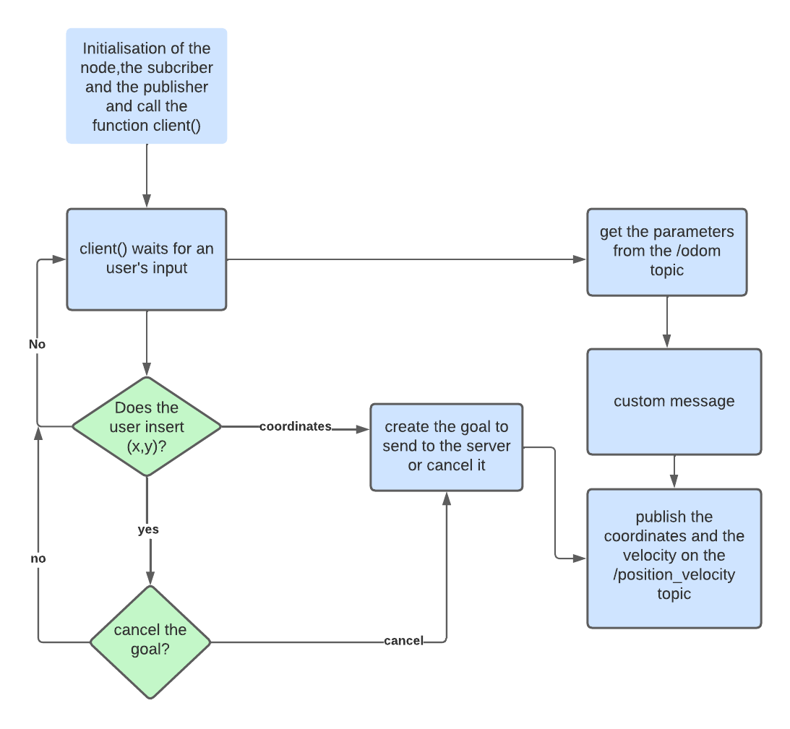

# RT_assignment_2

Miriam Anna Ruggero s4881702

## Description
The user is able to control a mobile robot in 3D simulation environment called *Gazebo*.
To do this the assignment requires to implement:
- (a) A node that implements an action client, allowing the user to set a target (x, y) or to cancel it. The node
also publishes the robot position and velocity as a custom message (x,y, vel_x, vel_z), by relying on the values
published on the topic /odom.
- (b) A service node that, when called, prints the number of goals reached and cancelled;
- (c) A node that subscribes to the robot’s position and velocity  and prints the
distance of the robot from the target and the robot’s average speed. 

## Nodes

Inside the scripts folder,there will be 6 nodes:

- `bug_as.py` is the file which implements the action server node.The node receives the desired position from the client and calls the useful services in oreder to bring the robot to the given position.The position is set  as a ROS parameter.
- `user_input.py` is the file which implements the action client node. The node asks the user to enter two coordinates (x,y) or to cancel them.After,it publishes the robot position and velocity as a custom message on the /*Position_velocity* topic, getting the values from the /*odom* topic. The structure of the node is described in the suqsequent flowchart:
  
<figure>

<figcaption align = "center"></figcaption>
</figure>
   

- `print_info.py` is the file which implements the info node.The node prints on the console the distance between the actual position of the robot and the desired position and the average speed of the robot.These parameters are taken from the 
*/Position_velocity* topic as a custom message.The frequency of printing is set as a parameter in the launch file.
- `go_to_point_service.py` is the file which implements a service node.When the node is called,it makes the robot moves to the desired position.
- `wall_follow_service.py` is the file which implements a service node.When the node is called,it makes the robot moves around an obstacle like a wall. 
- `service.py` is the file which implements a service node.When the node is called,it prints how many times a desired position was reached or cancelled.
To get the information about the number of goals reached and canceled, write on a command window:

    rosservice call /service

## Install and run

To run the master:

    roscore 

To install the module, you need to go inside the `src` folder of your ROS workspace and clone the assignment folder:

    git clone https://github.com/Miryru/RT_assignment_2

and from the root directory of your ROS workspace run the command:

    catkin_make

To run the program,It was neccessary to install **xterm**:

    sudo apt-get install xterm

To run the code:

    roslaunch assignment_2_2022 assignment1.launch

## Possible improvements

- It's not clear where the desired position is. It could be useful adding a graphical marker which highlights the right point.

- Adding a limitation to the coordinates's values.Infact when the user inserts some value out of space of the simulation,the robot doesn't respect the code instructions,so the program doesn't work properly.

- Improve the performance of the bug0 algorithm:give the robot the possibility of turning right when the end of the obstacle is nearer in the right direction.

- Improve the robot's performance:increase the robot linear velocity and robot angular velocity.

